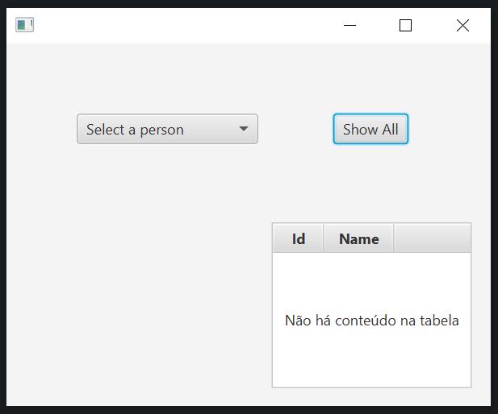
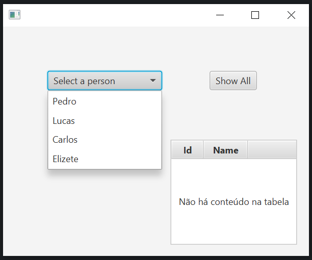
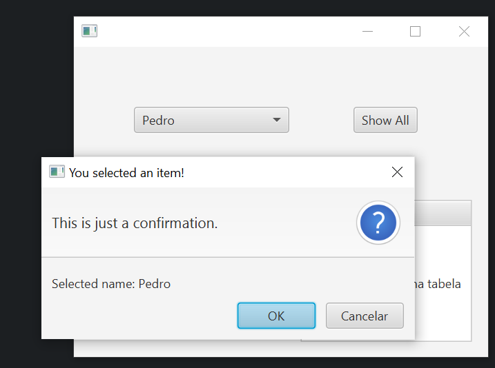
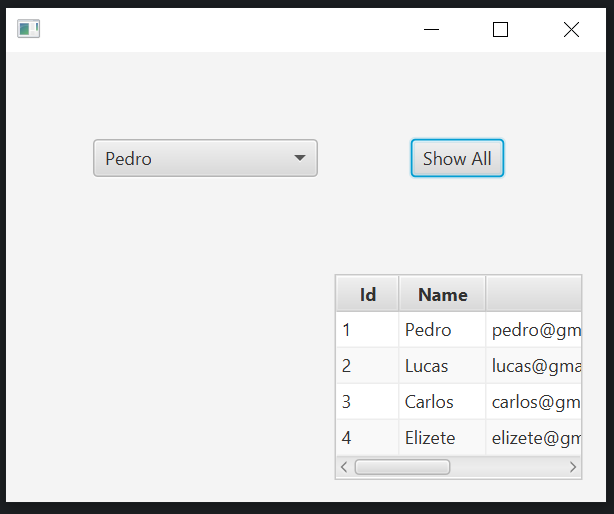

# JavaFX-GUI

At the beginning, it says inside the table "There is no content in the table."

The options available for the user to select:

Once selected, an alert is displayed for confirmation purposes only, showing which name was selected.

When the button "Show All" is clicked, a table with id, name and email of all people is shown.

